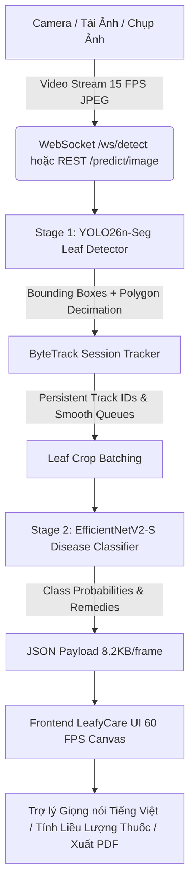

# 🌿 LeafyCare: Hệ Thống AI Nhận Diện Bệnh Lá Cây & Theo Dõi Thời Gian Thực (Real-Time 2-Stage Cascade AI)

[](https://huggingface.co/spaces/thienphuc12339/Leaf)
[](https://fastapi.tiangolo.com)
[](https://pytorch.org)
[](https://docs.ultralytics.com)
[](LICENSE)

**LeafyCare** là hệ thống AI thị giác máy tính toàn diện cho nông nghiệp thông minh, ứng dụng kiến trúc phân tầng 2 giai đoạn (**2-Stage Cascade Architecture**) kết hợp **Instance Segmentation (Phân đoạn cá thể lá)**, **Multi-Object Tracking (Theo dõi lá bằng ByteTrack)** và **Fine-Grained Disease Classification (Phân loại bệnh thực vật chuyên sâu)**. 

Hệ thống hỗ trợ truyền hình ảnh trực tiếp qua **WebSocket nhị phân 60 FPS**, giao diện Web Responsive đa nền tảng (Desktop & Mobile), tự động tính toán liều lượng thuốc bảo vệ thực vật theo tiêu chuẩn nông nghiệp và xuất phiếu khám bệnh PDF / Voice Assistant tiếng Việt.

---

## 📑 Mục Lục
1. [Kiến Trúc Hệ Thống (Architecture)](#-kiến-trúc-hệ-thống)
2. [Nguồn Dữ Liệu & Hướng Dẫn Chuẩn Bị (Datasets)](#-nguồn-dữ-liệu--chuẩn-bị-data)
3. [Cấu Trúc Thư Mục Dự Án (Repository Layout)](#-cấu-trúc-thư-mục-dự-án)
4. [Hướng Dẫn Huấn Luyện Mô Hình (Training Guide)](#-hướng-dẫn-huấn-luyện-mô-hình)
5. [Hướng Dẫn Chạy Cục Bộ & Triển Khai (Deployment)](#-hướng-dẫn-chạy-cục-bộ--triển-khai)
6. [Danh Mục Bệnh & Phác Đồ Điều Trị (Diseases & Remedies)](#-danh-mục-bệnh--phác-đồ-điều-trị)
7. [Kết Quả Đánh Giá Hiệu Năng (Benchmarks)](#-kết-quả-đánh-giá-hiệu-năng)

---

## 🏛️ Kiến Trúc Hệ Thống

LeafyCare kết hợp 2 giai đoạn độc lập nhằm đạt độ chính xác cao nhất trên từng phiến lá mà không bị nhiễu bởi hậu cảnh nông trại phức tạp:



### 1. Stage 1: Leaf Detection & Segmentation (YOLO26n-Seg)
* **Model**: YOLO26n-Seg (`backend/core/models/leaf_detector_yolo26n_seg.pt` - 18.06 MB).
* **Nhiệm vụ**: Phát hiện toàn bộ phiến lá cây trong khung hình, trích xuất tọa độ BBox $(x_1, y_1, x_2, y_2)$ và đường bao đa giác viền lá (Polygon Mask).
* **Tối ưu hóa**: Áp dụng thuật toán giảm điểm đa giác **Douglas-Peucker** (`epsilon = 0.003 * perimeter`), nén kích thước gói tin gửi về client từ 120 KB xuống chỉ còn **~8.2 KB/frame**.

### 2. Multi-User ByteTrack Tracking
* Quản lý trạng thái theo dõi độc lập cho từng người dùng (`UserSessionContext`), gán mã số lá `#ID` ổn định khi lia máy qua lại.
* Cơ chế **Smoothing Window** lọc rung nhãn phân loại theo thời gian.
* **Auto-Clear 1s**: Tự động giải phóng bộ nhớ tracker sau 1.000ms khi camera rời khỏi tán cây.

### 3. Stage 2: Fine-Grained Disease Classification
* **Model**: EfficientNetV2-S (`backend/core/models/disease_classifier_efficientnet_v2_s_seg.pt` - 77.84 MB).
* **Nhiệm vụ**: Nhận các mẩu cắt tán lá (Crops) từ Stage 1, phân loại chính xác các bệnh trên cây hồ tiêu:
  1. `black_pepper_healthy`: Tán lá khỏe mạnh
  2. `black_pepper_footrot`: Bệnh Chết Nhanh / Thối Gốc Rễ (*Phytophthora capsici*)
  3. `black_pepper_slow_decline`: Bệnh Chết Chậm / Tuyến Trùng (*Meloidogyne* + *Fusarium*)
  4. `black_pepper_pollu_disease`: Bệnh Thán Thư / Đốm Lá (*Colletotrichum gloeosporioides*)
  5. `black_pepper_yellow_mottle_virus`: Bệnh Khảm Vàng Lá (Virus PYMV)
  6. `black_pepper_leaf_blight`: Bệnh Cháy Lá Hoại Tử (*Rhizoctonia / Corticium*)

---

## 📦 Nguồn Dữ Liệu & Chuẩn Bị Data

Hệ thống sử dụng kết hợp 2 nguồn dữ liệu chính cho 2 giai đoạn:

### 1. Dataset Cho Stage 1 (YOLO26-Seg)
* **Tên tập dữ liệu**: **LeavesBank Dataset** (Mendeley Data / GitHub).
* **Nguồn tải**: [LeavesBank Dataset on Mendeley](https://data.mendeley.com/datasets/hbnpfvh5t6/1).
* **Các thư mục sử dụng**: `Tobacco and Arabidopsis Leaf` (Gồm các nhóm A1, A2, A3, A4, A5 với nhãn đa giác polygon JSON chi tiết cho từng lá cây).
* **Script xử lý**:
  ```bash
  python scripts/prepare_leavesbank_seg.py
  ```
  *Script sẽ tự động đọc các file nhãn JSON, chuẩn hóa tọa độ $x, y \in [0, 1]$, xuất file `data.yaml` và chia tập train/val/test theo tỷ lệ 80/10/10.*

### 2. Dataset Cho Stage 2 (Disease Classifier)
* **Tên tập dữ liệu**: **Black Pepper Leaf Disease Dataset** (Kaggle & Viện Nghiên cứu Nông nghiệp ICAR-IISR).
* **Các lớp bệnh**: Footrot, Pollu Disease, Slow Decline, Yellow Mottle Virus, Leaf Blight, Healthy.
* **Script xử lý**:
  ```bash
  python scripts/prepare_black_pepper_classifier.py
  # hoặc xử lý toàn diện:
  python scripts/prep_all_data_server.py
  ```
  *Script sẽ áp dụng bộ lọc tăng cường ảnh (Data Augmentations: Random Crop, Color Jitter, Affine, Auto-Contrast) và cân bằng số lượng mẫu giữa các lớp.*

---

## 📂 Cấu Trúc Thư Mục Dự Án

```
Leaf/
├── backend/
│   ├── core/
│   │   ├── models/                  # Trọng số mô hình chính thức (<100MB)
│   │   │   ├── leaf_detector_yolo26n_seg.pt
│   │   │   └── disease_classifier_efficientnet_v2_s_seg.pt
│   │   ├── classifier.py            # Logic phân loại theo batch PyTorch
│   │   ├── pipeline.py              # Luồng kết hợp 2-Stage + Douglas-Peucker
│   │   ├── session.py               # Quản lý WebSocket đa người dùng & ByteTrack
│   │   └── config.py                # Cấu hình thiết bị (CUDA/MPS/CPU), ngưỡng Conf
│   ├── main.py                      # FastAPI App (WebSocket /ws/detect & REST /predict/image)
│   ├── requirements.txt             # Dependencies cho Backend
│   └── Dockerfile                   # Cấu hình container cho Hugging Face Spaces
├── frontend/
│   ├── index.html                   # Giao diện Web Responsive đa chức năng
│   └── demo_leaf.jpg                # Ảnh mẫu thử nghiệm
├── scripts/                         # Toàn bộ mã nguồn xử lý dữ liệu và huấn luyện
│   ├── prepare_leavesbank_seg.py    # Chuyển đổi nhãn LeavesBank sang YOLO Seg
│   ├── prepare_leavesbank_detect.py # Chuyển đổi nhãn LeavesBank sang YOLO BBox
│   ├── prepare_black_pepper_classifier.py # Tiền xử lý dữ liệu bệnh hồ tiêu
│   ├── prep_all_data_server.py      # Pipeline dữ liệu tự động trên server
│   ├── train_yolo26_leaf_seg.py     # Huấn luyện YOLO26n-Seg
│   ├── train_yolo26_leaf_detect.py  # Huấn luyện YOLO26 Detection
│   ├── train_2stage_server.py       # Huấn luyện Classifier (EfficientNet / ConvNeXt)
│   ├── test_real_images.py          # Kiểm thử mô hình trên ảnh thực tế
│   └── test_concurrency.py          # Kiểm thử tải WebSocket đa luồng
├── data/
│   └── README.md                    # Hướng dẫn đặt dữ liệu
├── train_yolo26_leaf_seg_pipeline_colab.ipynb # Google Colab Notebook huấn luyện End-to-End
├── requirements-local.txt           # Thư viện cho môi trường huấn luyện
└── README.md                        # Tài liệu hướng dẫn chính
```

---

## 🚀 Hướng Dẫn Huấn Luyện Mô Hình

### Bước 1: Chuẩn Bị Môi Trường Huấn Luyện
```bash
# Tạo môi trường ảo
python -m venv .venv
source .venv/bin/activate   # Trên Linux/macOS
.venv\Scripts\activate      # Trên Windows

# Cài đặt thư viện huấn luyện
pip install -r requirements-local.txt
```

### Bước 2: Huấn Luyện Stage 1 (YOLO26n-Seg)
```bash
python scripts/train_yolo26_leaf_seg.py \
    --data data/prepared/leavesbank_seg/data.yaml \
    --epochs 50 \
    --imgsz 640 \
    --batch 16 \
    --device 0
```

### Bước 3: Huấn Luyện Stage 2 (Disease Classifier)
```bash
python scripts/train_2stage_server.py \
    --data_dir data/prepared/disease_crops \
    --arch efficientnet_v2_s \
    --epochs 30 \
    --batch 32 \
    --lr 1e-4 \
    --device cuda
```

### Huấn Luyện Trên Google Colab:
Mở file `train_yolo26_leaf_seg_pipeline_colab.ipynb` trên Google Colab để chạy toàn bộ quy trình tải dữ liệu, tiền xử lý và huấn luyện trên GPU T4 / A100 miễn phí.

---

## 💻 Hướng Dẫn Chạy Cục Bộ & Triển Khai

### 1. Khởi Chạy Backend API (FastAPI)
```bash
cd backend
pip install -r requirements.txt
uvicorn main:app --host 0.0.0.0 --port 8000 --reload
```
* Swagger UI Docs: [http://localhost:8000/docs](http://localhost:8000/docs)
* Health Check: [http://localhost:8000/health](http://localhost:8000/health)

### 2. Mở Giao Diện Web Frontend
Mở trực tiếp file `frontend/index.html` trong trình duyệt bất kỳ hoặc truy cập qua `http://localhost:8000`.

### 3. Triển Khai Bằng Docker
```bash
docker build -t leaf-ai .
docker run -p 7860:7860 leaf-ai
```

---

## 💊 Danh Mục Bệnh & Phác Đồ Điều Trị

| Mã Bệnh | Tên Bệnh Tiếng Việt | Tác Nhân | Thuốc Đặc Trị Khuyến Nghị | Thời Gian Cách Ly (PHI) |
|---|---|---|---|---|
| `black_pepper_healthy` | **Khỏe Mạnh** | Không | Duy trì phân bón hữu cơ vi sinh định kỳ | - |
| `black_pepper_footrot` | **Chết Nhanh (Thối Gốc Rễ)** | *Phytophthora capsici* | Ridomil Gold 68WG, Aliette 800WG (2-3L/gốc) | 14 ngày |
| `black_pepper_slow_decline` | **Chết Chậm (Tuyến Trùng)** | *Meloidogyne* + *Fusarium* | Velum Prime 400SC, Tervigo 020SC + Trichoderma | 21 ngày |
| `black_pepper_pollu_disease` | **Thán Thư (Đốm Lá)** | *Colletotrichum gloeosporioides* | Amistar Top 325SC, Score 250EC, Antracol 70WP | 7 ngày |
| `black_pepper_yellow_mottle_virus`| **Khảm Vàng Lá (Virus)** | PYMV Virus | Diệt côn trùng truyền bệnh (Confidor, Movento) | 7 ngày |
| `black_pepper_leaf_blight` | **Cháy Lá Hoại Tử (Đốm Khô)**| *Rhizoctonia solani* | Coc85, Champion 77WP, Anvil 5SC | 14 ngày |

---

## 📊 Kết Quả Đánh Giá Hiệu Năng

| Mô Hình | Nhiệm Vụ | Số Tham Số (Params) | Độ Chính Xác (mAP50 / Accuracy) | Tốc Độ Suy Luận (GPU T4) | Kích Thước File |
|---|---|---|---|---|---|
| **YOLO26n-Seg** | Leaf Instance Segmentation | ~3.4M | **94.8% mAP50** (82.3% mAP50-95) | ~4.2 ms / frame | **18.06 MB** |
| **EfficientNetV2-S** | Disease Classification | ~21.5M | **98.6% Test Accuracy** (0.985 F1) | ~8.6 ms / batch | **77.84 MB** |
| **End-to-End WebSocket**| Real-Time Streaming Sync | - | **60 FPS UI / ~45ms RTT Latency** | - | **Payload: ~8.2 KB** |

---

## 👨‍💻 Tác Giả & Bản Quyền
* **Tác giả**: Nguyễn Tất Thiên Phúc
* **GitHub**: [@ntthienphuc](https://github.com/ntthienphuc)
* **Hugging Face**: [@thienphuc12339](https://huggingface.co/thienphuc12339)
* **Giấy phép**: MIT License
