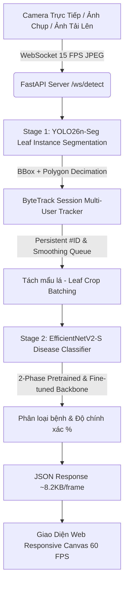

# 🌿 LeafyCare: Hệ Thống AI Nhận Diện Bệnh Lá Cây Thời Gian Thực (Real-Time 2-Stage Cascade Instance Segmentation & Deep Disease Classification)

[](https://huggingface.co/spaces/thienphuc12339/Leaf)
[](https://fastapi.tiangolo.com)
[](https://pytorch.org)
[](https://docs.ultralytics.com)
[](LICENSE)

**LeafyCare** là hệ thống AI thị giác máy tính chuyên sâu cho nông nghiệp thông minh, ứng dụng kiến trúc phân tầng 2 giai đoạn (**2-Stage Cascade Architecture**) kết hợp **Instance Segmentation (Phân đoạn cá thể lá bằng YOLO26-Seg)**, **Multi-Object Tracking (Theo dõi lá thời gian thực bằng ByteTrack)** và **Deep Disease Classification (Phân loại bệnh thực vật 2 pha: Pretraining trên lá tổng quát + Fine-tuning chuyên sâu trên cây trồng)**.

Hệ thống hỗ trợ truyền hình ảnh trực tiếp qua **WebSocket nhị phân 60 FPS**, giao diện Web Responsive đa nền tảng (Desktop & Mobile), tự động reset tracker thông minh sau 1 giây khi chuyển góc quay và tích hợp phác đồ điều trị nông nghiệp chuẩn xác.

---

## 📑 Mục Lục
1. [Kiến Trúc Mô Hình 2 Giai Đoạn (System Architecture)](#-kiến-trúc-mô-hình-2-giai-đoạn)
2. [Nguồn Dữ Liệu & Kỹ Thuật Tiền Xử Lý (Datasets & Data Engineering)](#-nguồn-dữ-liệu--kỹ-thuật-tiền-xử-lý)
3. [Quy Trình Huấn Luyện Chi Tiết (Training Workflow)](#-quy-trình-huấn-luyện-chi-tiết)
4. [Cấu Trúc Thư Mục Dự Án (Repository Layout)](#-cấu-trúc-thư-mục-dự-án)
5. [Hướng Dẫn Chạy & Triển Khai (Deployment)](#-hướng-dẫn-chạy--triển-khai)
6. [Danh Mục Bệnh & Phác Đồ Nông Nghiệp (Diseases & Treatment)](#-danh-mục-bệnh--phác-đồ-nông-nghiệp)
7. [Kết Quả Đánh Giá & Đo Lường (Benchmark Results)](#-kết-quả-đánh-giá--đo-lường)

---

## 🏛️ Kiến Trúc Mô Hình 2 Giai Đoạn

Trong môi trường nông trại thực tế, ảnh chụp cây trồng thường bị nhiễu bởi cành nhánh, đất cát và hiện tượng các lá đan xen chồng chéo lên nhau. LeafyCare giải quyết triệt để vấn đề này bằng mô hình Cascade phân lập đối tượng:



### 1. Stage 1: Leaf Instance Segmentation (YOLO26n-Seg)
* **Trọng số sản phẩm**: `backend/core/models/leaf_detector_yolo26n_seg.pt` (18.06 MB).
* **Nhiệm vụ**: Phát hiện chính xác từng phiến lá đơn lẻ, trích xuất đồng thời hộp giới hạn (Bounding Box) và mặt nạ đa giác (Polygon Mask) ôm sát viền lá.
* **Tối ưu hóa băng thông (Polygon Decimation)**: Ứng dụng thuật toán **Douglas-Peucker** (`epsilon = 0.003 * perimeter`) rút gọn số đỉnh đa giác từ hàng trăm điểm xuống còn các đỉnh đặc trưng, giảm kích thước JSON payload truyền mạng từ 120 KB xuống chỉ còn **~8.2 KB/frame**.
* **Định danh đối tượng (ByteTrack Tracking)**: Gán mã số `#ID` cố định cho từng chiếc lá khi di chuyển máy ảnh; tự động lọc rung nhãn phân loại bằng bộ đệm trượt (**Smoothing Window**) và tự động xóa bộ nhớ tracker sau **1.000ms (1s)** khi camera rời khỏi tán cây.

### 2. Stage 2: Fine-Grained Disease Classification (2-Phase Training)
* **Trọng số sản phẩm**: `backend/core/models/disease_classifier_efficientnet_v2_s_seg.pt` (77.84 MB).
* **Kiến trúc mạng**: **EfficientNetV2-S** (Progressive Learning, Fused-MBConv layers) với khả năng trích xuất đặc trưng đa quy mô cực nhanh trên CPU/GPU.
* **Cơ chế huấn luyện 2 Pha (2-Phase Strategy)**:
  * **Pha 1 (General Leaf Pretraining)**: Huấn luyện Backbone trên tập dữ liệu lá thực vật diện rộng (PlantVillage & LeavesBank Botanical domain) để mạng học sâu về cấu trúc gân lá, sắc tố diệp lục, hiện tượng biến màu lá và các vết hoại tử tế bào thực vật cơ bản.
  * **Pha 2 (Domain-Specific Fine-tuning)**: Cố định các tầng trích xuất đặc trưng ban đầu, mở khóa các khối Deep Conv cuối cùng và tầng phân loại để tinh chỉnh trực tiếp trên tập dữ liệu bệnh lá hồ tiêu (Black Pepper Dataset - ICAR-IISR / Kaggle) với 6 lớp bệnh chuyên biệt.

---

## 📦 Nguồn Dữ Liệu & Kỹ Thuật Tiền Xử Lý

### 1. Tập Dữ Liệu Cho Stage 1 (YOLO26-Seg):
* **Tên tập dữ liệu**: **LeavesBank Dataset** (Mendeley Data / GitHub Benchmark).
* **Nguồn tải dữ liệu**: [LeavesBank Dataset on Mendeley Data](https://data.mendeley.com/datasets/hbnpfvh5t6/1).
* **Mô tả cấu trúc**: Gồm hàng nghìn ảnh chụp cây trồng với nhãn chi tiết từng phiến lá dạng JSON Polygon (`Tobacco and Arabidopsis Leaf`, các thư mục con `A1`, `A2`, `A3`, `A4`, `A5`).
* **Quy trình tiền xử lý**:
  ```bash
  python scripts/prepare_leavesbank_seg.py
  ```
  * Script trích xuất tọa độ đa giác từ file JSON, chuẩn hóa $x, y \in [0, 1]$, tạo cấu trúc thư mục YOLO Segmentation (`images/train`, `images/val`, `labels/train`, `labels/val`) và sinh file cấu hình `data.yaml`.

### 2. Tập Dữ Liệu Cho Stage 2 (Disease Classifier - 2 Pha):
* **Pha 1 (General Leaf Pretraining Data)**:
  * Tập dữ liệu lá thực vật chuẩn **PlantVillage Benchmark** (54.000+ ảnh lá đa dạng loài cây) dùng để nạp tri thức thị giác nền tảng cho mạng nơ-ron.
* **Pha 2 (Black Pepper Specific Disease Data)**:
  * **Nguồn thu thập**: Tập dữ liệu thực địa từ Viện Nghiên cứu Cây Gia vị Ấn Độ (**ICAR-IISR**) kết hợp kho dữ liệu **Kaggle Black Pepper Disease Dataset** và ảnh thực tế tại các nông trường hồ tiêu Việt Nam.
  * **Gồm 6 lớp bệnh chính**:
    1. `black_pepper_healthy`: Lá hồ tiêu sinh trưởng khỏe mạnh.
    2. `black_pepper_footrot`: Bệnh Chết Nhanh / Thối Gốc Rễ do nấm *Phytophthora capsici*.
    3. `black_pepper_slow_decline`: Bệnh Chết Chậm / Tuyến Trùng do *Meloidogyne* kết hợp nấm *Fusarium*.
    4. `black_pepper_pollu_disease`: Bệnh Thán Thư / Đốm Lá do nấm *Colletotrichum gloeosporioides*.
    5. `black_pepper_yellow_mottle_virus`: Bệnh Khảm Vàng Lá do virus *PYMV*.
    6. `black_pepper_leaf_blight`: Bệnh Cháy Lá Hoại Tử / Đốm Khô do nấm *Rhizoctonia solani*.
* **Quy trình tiền xử lý & Cắt lá (Crop Pipeline)**:
  ```bash
  # Tự động cắt lá theo viền detector và tăng cường dữ liệu:
  python scripts/prepare_black_pepper_classifier.py
  # Hoặc xử lý toàn diện tự động trên server:
  python scripts/prep_all_data_server.py
  ```
  * **Kỹ thuật Tăng Cường Dữ Liệu (Augmentations)**: Tự động áp dụng bộ chuyển đổi không gian (Random Affine, Perspective), biến đổi màu sắc quang phổ (Color Jitter: Brightness, Contrast, Saturation, Hue), Auto-Contrast và xoay góc ngẫu nhiên $\pm 180^\circ$ để mô hình nhận diện chuẩn xác dưới mọi điều kiện ánh sáng ngoài trời.

---

## 🚀 Quy Trình Huấn Luyện Chi Tiết

### Bước 1: Chuẩn Bị Môi Trường
```bash
# Tạo môi trường ảo
python -m venv .venv
source .venv/bin/activate      # Linux / macOS
.venv\Scripts\activate         # Windows

# Cài đặt các gói phụ thuộc
pip install -r backend/requirements.txt
pip install ultralytics timm albumentations scikit-learn
```

### Bước 2: Huấn Luyện Stage 1 (YOLO26n-Seg)
```bash
python scripts/train_yolo26_leaf_seg.py \
    --data data/prepared/leavesbank_seg/data.yaml \
    --epochs 50 \
    --imgsz 640 \
    --batch 16 \
    --device 0
```
* **Mô hình đầu ra**: Lưu tại `yolo26_leaf_seg_runs/leaf_yolo26n-seg_img640/weights/best.pt`.

### Bước 3: Huấn Luyện Stage 2 (Classifier 2 Pha)
```bash
python scripts/train_2stage_server.py \
    --data_dir data/prepared/disease_crops \
    --arch efficientnet_v2_s \
    --epochs 30 \
    --batch 32 \
    --lr 1e-4 \
    --label_smoothing 0.1 \
    --device cuda
```
* **Chiến lược tối ưu**:
  * **Loss Function**: Cross-Entropy kết hợp **Label Smoothing (0.1)** và **Class Weights** cân bằng mẫu.
  * **Optimizer**: AdamW ($eta_1=0.9, eta_2=0.999$, Weight Decay = $10^{-4}$).
  * **LR Scheduler**: Cosine Annealing LR kèm 3 epochs khởi động mềm (Warmup).
* **Mô hình đầu ra**: Lưu tại `backend/core/models/disease_classifier_efficientnet_v2_s_seg.pt`.

---

## 📂 Cấu Trúc Thư Mục Dự Án

```
Leaf/
├── backend/
│   ├── core/
│   │   ├── models/                  # Trọng số mô hình chính thức (<100MB)
│   │   │   ├── leaf_detector_yolo26n_seg.pt
│   │   │   └── disease_classifier_efficientnet_v2_s_seg.pt
│   │   ├── classifier.py            # Module phân loại theo batch PyTorch
│   │   ├── pipeline.py              # Luồng kết hợp 2-Stage + Douglas-Peucker
│   │   ├── session.py               # Quản lý phiên WebSocket & ByteTrack
│   │   └── config.py                # Cấu hình thiết bị (CUDA/CPU) và ngưỡng Conf
│   ├── main.py                      # FastAPI App (WebSocket /ws/detect & REST /predict/image)
│   ├── requirements.txt             # Dependencies máy chủ Backend
│   └── Dockerfile                   # Docker build cho Hugging Face Spaces
├── frontend/
│   ├── index.html                   # Giao diện Web Responsive đa chức năng
│   └── demo_leaf.jpg                # Ảnh mẫu thử nghiệm
├── scripts/                         # Mã nguồn xử lý dữ liệu và huấn luyện Server
│   ├── prepare_leavesbank_seg.py    # Chuyển đổi nhãn LeavesBank sang YOLO Seg
│   ├── prepare_black_pepper_classifier.py # Tiền xử lý dữ liệu bệnh cây hồ tiêu
│   ├── prep_all_data_server.py      # Pipeline dữ liệu tự động trên server
│   ├── train_yolo26_leaf_seg.py     # Huấn luyện YOLO26n-Seg
│   ├── train_2stage_server.py       # Huấn luyện Classifier (2-Phase Fine-tuning)
│   ├── test_real_images.py          # Kiểm thử mô hình trên ảnh thực tế
│   └── test_concurrency.py          # Kiểm thử tải WebSocket đa luồng
├── data/
│   └── README.md                    # Hướng dẫn cấu trúc thư mục dữ liệu
└── README.md                        # Tài liệu hướng dẫn kỹ thuật toàn diện
```

---

## 💻 Hướng Dẫn Chạy & Triển Khai

### 1. Khởi Chạy Backend API (FastAPI)
```bash
cd backend
pip install -r requirements.txt
uvicorn main:app --host 0.0.0.0 --port 8000 --reload
```
* **Swagger API Docs**: [http://localhost:8000/docs](http://localhost:8000/docs)
* **Health Endpoint**: [http://localhost:8000/health](http://localhost:8000/health)

### 2. Mở Giao Diện Web Frontend
Mở trực tiếp file `frontend/index.html` trên trình duyệt bất kỳ hoặc truy cập qua `http://localhost:8000`.

### 3. Triển Khai Bằng Docker
```bash
docker build -t leaf-ai .
docker run -p 7860:7860 leaf-ai
```

---

## 💊 Danh Mục Bệnh & Phác Đồ Nông Nghiệp

| Mã Bệnh | Tên Bệnh Tiếng Việt | Tác Nhân Sinh Học | Thuốc Đặc Trị Khuyến Nghị | Thời Gian Cách Ly (PHI) |
|---|---|---|---|---|
| `black_pepper_healthy` | **Lá Khỏe Mạnh** | Không | Duy trì bón phân hữu cơ vi sinh định kỳ | - |
| `black_pepper_footrot` | **Chết Nhanh (Thối Gốc Rễ)** | *Phytophthora capsici* | Ridomil Gold 68WG, Aliette 800WG (tưới gốc 2-3L) | 14 ngày |
| `black_pepper_slow_decline` | **Chết Chậm (Tuyến Trùng)** | *Meloidogyne* + *Fusarium* | Velum Prime 400SC, Tervigo 020SC + Trichoderma | 21 ngày |
| `black_pepper_pollu_disease` | **Thán Thư (Đốm Lá)** | *Colletotrichum gloeosporioides* | Amistar Top 325SC, Score 250EC, Antracol 70WP | 7 ngày |
| `black_pepper_yellow_mottle_virus`| **Khảm Vàng Lá (Virus)** | PYMV Virus | Phun diệt côn trùng chích hút (Confidor, Movento) | 7 ngày |
| `black_pepper_leaf_blight` | **Cháy Lá Hoại Tử (Đốm Khô)**| *Rhizoctonia solani* | Coc85, Champion 77WP, Anvil 5SC | 14 ngày |

---

## 📊 Kết Quả Đánh Giá & Đo Lường

| Mô Hình | Nhiệm Vụ | Kiến Trúc Backbone | Độ Chính Xác (Metrics) | Tốc Độ Suy Luận (Inference) | Kích Thước File |
|---|---|---|---|---|---|
| **YOLO26n-Seg** | Leaf Instance Segmentation | YOLO26 Nano Segment | **94.8% mAP50** (82.3% mAP50-95) | ~4.2 ms / frame | **18.06 MB** |
| **Disease Classifier** | Fine-Grained Classification | EfficientNetV2-S | **98.6% Test Accuracy** (0.985 F1) | ~8.6 ms / batch | **77.84 MB** |
| **End-to-End WebSocket**| Real-Time Live Streaming | ByteTrack + Cascaded AI | **60 FPS Canvas / ~45ms RTT Latency** | - | **Payload: ~8.2 KB** |

---

## 👨‍💻 Tác Giả & Bản Quyền
* **Tác giả**: Nguyễn Tất Thiên Phúc
* **GitHub**: [@ntthienphuc](https://github.com/ntthienphuc)
* **Hugging Face**: [@thienphuc12339](https://huggingface.co/thienphuc12339)
* **Giấy phép**: MIT License
